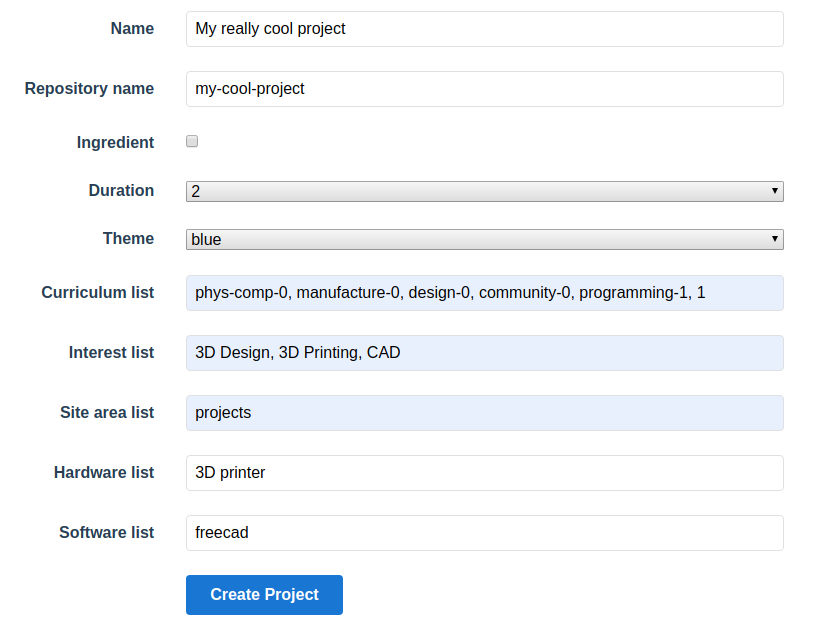

## Quick start

1. Login to the [admin panel of the projects site](https://learning-admin.raspberrypi.org/admin/projects)
2. Click on the `New Project`{:class="blockmotion"} button.
3. Complete the project information and click on `Create Project`{:class="blockmotion"}

```text
Name: My really cool project ##Can be what you like
Repository name: my-cool-project ##Keep it short - this will be the slug
Ingredient: [ ]
Duration: [1] ##1 is less than hour, 2 is a few hours, 3 is many hours
Theme: Blue ##Whatever takes your fancy
Curriculum list: phys-comp-0, manufacture-0, design-0, community-0, programming-1, 1 ##scale of 1-4, last value is for the whole project
Interest list: 3D Design, 3D Printing, CAD ##tags
Site area list: projects ##needs to be projects 
Hardware list: 3D printer ##tags
Software list: freecad ##tags
```
4. Navigate to [GitHub](https://github.com/raspberrypilearning/), clone the newly created repository, then switch to the **Draft** branch.
5. Write your steps, ensuring that `step_1.md` is the "Introduction" and that the final step is a "What next?"
6. After completing each step you can commit your project and it should build and be displayed at `https://learning-admin.raspberrypi.org/en/projects.project-name`
7. If it does not build then check the status of the build on [#project-notifications](https://raspberrypifoundation.slack.com/messages/CJCB193BJ) on Slack. Fix any build errors.
8. Have the project tested by a member of your team, and act on the feedback
9. Submit your project to Copy Edit by filling in the [wufoo](https://commsraspberrypi.wufoo.com/forms/comms-team-work-request/) form.
10. Use another form to request cover art for the project
11. Once copy edit is complete, **Pull** the changes to your local repo.
12. update the `meta.yml` file and commit and push to draft

```yaml
title: My really cool project
hero_image: images/banner.png
description: A really cool project
version: 4
listed: true
copyedit: true
last_tested: "YYYY-MM-DD"
steps:
  - title: Introduction
  - title: Making a cool project
  - title: What next?
```

13. Back on GitHub, create a new pull request, `Master <-- Draft`
14. Submit and accept the pull request and check `#project-notifications`.

