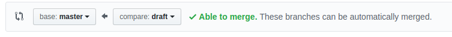

## Publishing

- Prior to publishing your resource, it needs testing by a one or more members of the informal learning team.

- It is also a good idea to submit the project to be tested on a [makerday](https://raspberrypifoundation.slack.com/messages/C38GR6T3J){:target="_blank"}

- Following testing, submit your resource to be Copy Edited, using the [following form](https://commsraspberrypi.wufoo.com/forms/comms-team-work-request/){:target="_blank"}.

- Use another form to request a `banner.png` image for the resource

- Once copy edit has been completed you can publish the resource. You do not need to wait for the cover art to be produced.

- Change `listed: false` to `listed: true` in the meta.yml, so it can be indexed on the projects main page.

1. On GitHub click on the `New pull request` button

1. Ensure `draft` is being merged into `master`

1. Then click on the `Create pull request` button

1. Click on `Merge pull request`

1. Click on `Confirm merge` button.

1. Check [Slack project-notifications](https://raspberrypifoundation.slack.com/messages/CJCB193BJ){:target="_blank"} to ensure the project builds.
1. The project can be viewed at `projects.raspberrypi.org/en/projects/project-name`

